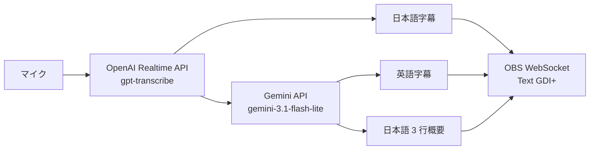

# Realtime Summary Generator

日本語のマイク音声から、日本語字幕、英語字幕、日本語の 3 行概要を生成し、OBS Studio へリアルタイム表示する Windows 向けツールです。音声認識と文章生成は外部 API で処理するため、配信 PC の GPU を使いません。

個人利用を前提に改善中の PoC です。Windows、Python 3.13、OBS Studio 32.2.2 で動作を確認しています。

## 機能

- 認識途中の日本語を字幕として表示
- 確定した日本語字幕を簡潔な英語字幕へ翻訳
- 確定した発話から日本語の 3 行概要を約 20 秒ごとに更新
- OBS WebSocket で Text (GDI+) の本文だけを更新
- 音声や字幕本文を含めない構造化診断ログ
- ローカル GPU、ブラウザーソース、ローカル Web サーバーが不要

## 処理の流れ



詳しい処理順序と障害時の挙動は[構成とデータフロー](docs/architecture.md)を参照してください。

## 必要なもの

- Windows
- Python 3.13 以降
- OBS Studio 32.2.2 (ほかのバージョンは未確認)
- [OpenAI API キー](https://platform.openai.com/api-keys)
- [Gemini API キー](https://aistudio.google.com/app/apikey)

OpenAI API と Gemini API の利用料が発生します。採用モデルの現在の単価は、[OpenAI API の料金](https://developers.openai.com/api/docs/pricing)と[Gemini API の料金](https://ai.google.dev/gemini-api/docs/pricing)で確認してください。

## セットアップ

### 1. リポジトリの取得

PowerShell で実行します。

```powershell
git clone https://github.com/AllegroMoltoV/realtime-summary-generator.git
Set-Location realtime-summary-generator
```

### 2. Python パッケージのインストール

プロジェクト専用の仮想環境を作り、実行時依存をインストールします。

```powershell
py -3.13 -m venv .venv
.\.venv\Scripts\python.exe -m pip install -e .
```

### 3. 認証情報の設定

設定雛形をリポジトリ直下の `.env` へコピーします。

```powershell
Copy-Item .env.example .env
```

`.env` を開き、三つの値を設定します。値を囲む `<` と `>` は入力しません。

```dotenv
OPENAI_API_KEY=<OpenAI API key>
GEMINI_API_KEY=<Gemini API key>
OBS_WEBSOCKET_PASSWORD=<OBS WebSocket password>
```

`.env` は Git 管理対象から除外されていますが、平文ファイルです。画面共有、バックアップ、ファイル同期サービスによる漏えいに注意してください。

### 4. OBS WebSocket の設定

OBS の「ツール」から「WebSocket サーバー設定」を開き、次の項目を設定します。

- WebSocket サーバーを有効にする
- サーバーポートを `4455` にする
- 認証を有効にし、`.env` と同じパスワードを設定する

OBS WebSocket は OBS Studio 32.2.2 に同梱されているため、別途プラグインを追加する必要はありません。

### 5. OBS テキストソースの作成

使用するシーンへ Text (GDI+) ソースを三つ作成します。ソース名は次の文字列と完全に一致させてください。

- `字幕（日本語）`
- `字幕（英語）`
- `概要（日本語）`

三つのソースすべてで `Read from file` を無効にします。フォント、文字サイズ、色、縁取り、背景、配置、折り返し範囲は OBS 側で設定します。ツールは本文だけを更新します。

## 起動と終了

先に OBS を起動し、リポジトリのルートで次のコマンドを実行します。

```powershell
.\.venv\Scripts\realtime-summary.exe
```

次のメッセージが表示されたら開始しています。

```text
字幕・英訳・概要の更新を開始しました。終了するには Ctrl+C を押してください。
```

終了するには `Ctrl+C` を押します。通常終了時と次回起動時に、三つの OBS テキストを空にします。

## 設定

`.env` へ次の項目を設定できます。同じ名前の環境変数がある場合は、環境変数を優先します。

| 項目 | 必須 | 既定値 | 内容 |
| --- | --- | --- | --- |
| `OPENAI_API_KEY` | はい | なし | OpenAI API キー |
| `GEMINI_API_KEY` | はい | なし | Gemini API キー |
| `OBS_WEBSOCKET_PASSWORD` | はい | なし | OBS WebSocket の認証パスワード |
| `AUDIO_INPUT_DEVICE` | いいえ | Windows の既定入力 | `sounddevice` が表示する数値 ID |
| `LOG_LEVEL` | いいえ | `INFO` | `DEBUG`、`INFO`、`WARNING`、`ERROR` |

入力デバイスの一覧は次のコマンドで表示できます。

```powershell
.\.venv\Scripts\python.exe -m sounddevice
```

使用するデバイスの数値 ID を `.env` へ設定します。

```dotenv
AUDIO_INPUT_DEVICE=12
```

デバイス ID は、再起動や音声機器の接続変更で変わる場合があります。

## 診断ログ

診断ログは `.logs/realtime-summary.jsonl` へ JSON Lines 形式で出力します。ログには処理時間、キュー状態、API と OBS の成否、トークン使用量、エラー種別が含まれます。

OpenAI Realtime API との接続が一時的に切れた場合は、最大 5 回まで自動で再接続します。切断コード、切断理由、接続時間、再試行回数、待機時間、破棄した音声チャンク数も診断ログへ記録します。

音声、発話、字幕、英訳、概要、API キー、OBS WebSocket パスワードは `DEBUG` でも記録しません。ただし、デバイス名やスタックトレース内のローカルファイルパスを含む場合があります。公開された Issue へログを添付する前に内容を確認してください。

症状別の確認方法は[トラブルシューティング](docs/troubleshooting.md)を参照してください。

## データの扱い

- マイク音声を OpenAI Realtime API へ送信します。
- 確定した日本語発話を英訳と概要生成のため Gemini API へ送信します。
- 字幕と概要をローカルの OBS WebSocket へ送信します。
- ツールは音声、字幕、英訳、概要の履歴ファイルを作りません。
- OBS がシーンコレクションを保存すると、表示中の文字列が OBS の設定やバックアップへ残る場合があります。
- 外部 API 側のデータ保持条件は、各サービスの規約を確認してください。

## 現在の制約

- Windows の Text (GDI+) を対象としています。
- 入力言語と概要は日本語に固定されています。
- OBS の接続先は `127.0.0.1:4455`、ソース名は前述の三つに固定されています。
- GUI とプロバイダー切替機能はありません。

## 開発

開発用依存をインストールし、テストを実行します。外部 API、マイク、OBS は単体テストで使用しません。

```powershell
.\.venv\Scripts\python.exe -m pip install -e ".[dev]"
.\.venv\Scripts\python.exe -m pytest
```

公開文書の一覧は[文書索引](docs/INDEX.md)を参照してください。

## ライセンス

このソフトウェアは[MIT License](LICENSE)で公開しています。

## 更新情報

- 0.1.0 (2026-09-13): 日本語字幕、英語字幕、日本語 3 行概要、OBS WebSocket 出力、`.env` 読込みを含む初版を公開。
