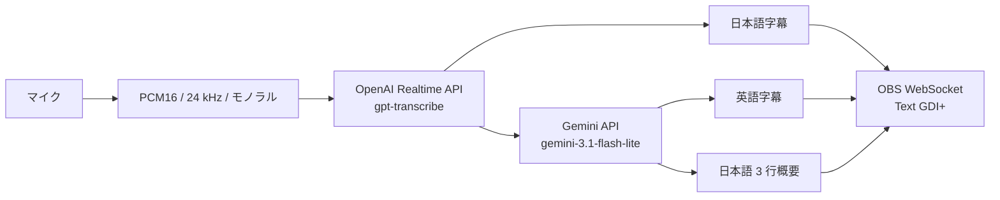

# 構成とデータフロー

## 目的

このツールは、日本語のマイク音声から日本語字幕、英語字幕、日本語の 3 行概要を生成し、OBS Studio へ表示します。配信 PC の GPU を使わず、音声認識と文章生成を外部 API で処理します。

## 全体構成

日本語字幕は認識途中の差分から更新します。英訳は発話の確定後に生成します。概要は確定した発話を蓄積し、新しい発話がある場合に約 20 秒間隔で更新します。

## 構成要素

| ファイル | 役割 |
| --- | --- |
| `app.py` | OBS、マイク、OpenAI、Gemini の起動と終了 |
| `audio.py` | マイク音声の取得と上限付きキュー |
| `transcription.py` | OpenAI Realtime API への音声送信と発話順序の管理 |
| `text_processing.py` | Gemini による英訳と 3 行概要の生成 |
| `obs_output.py` | 三つの Text (GDI+) ソースの検査と更新 |
| `state.py` | 確定発話、発話順序、概要用の短期状態 |
| `diagnostics.py` | 本文を含めない JSON Lines 診断ログ |
| `config.py` | `.env` と環境変数からの設定読込み |

## 発話と表示の順序

OpenAI が割り当てた `item_id` と `previous_item_id` から発話順序を決めます。転写完了イベントが前後して届いた場合も、確定した順序で英訳と概要へ渡します。

日本語字幕は英訳を待ちません。英訳が前後して完了した場合は、新しい英訳を古い結果で上書きしません。概要生成中に届いた発話は次の更新対象として保持します。

## 負荷上限

音声キューは 50 チャンクを上限とします。送信が入力へ追い付かない場合は古いチャンクから破棄し、破棄数を終了時のログへ記録します。

概要生成に失敗した発話は次回へ戻します。失敗が続いた場合の保持量は直近 3 周期分までとし、それより古い周期を破棄します。日本語字幕は英訳や概要の失敗から独立して更新を続けます。

## OBS 出力

OBS WebSocket の `SetInputSettings` で、Text (GDI+) ソースの `text` だけを更新します。フォント、色、縁取り、背景、配置は OBS 側の設定を維持します。

接続先とソース名は現在の実装で固定されています。

- ホスト: `127.0.0.1`
- ポート: `4455`
- ソース名: `字幕（日本語）`、`字幕（英語）`、`概要（日本語）`

起動時に三つのソースが存在し、Text (GDI+) であり、`Read from file` が無効であることを確認します。起動時と終了時には三つの表示を空にします。

## 障害時の挙動

- OBS の接続または事前確認に失敗した場合は、外部 API を使う前に終了します。
- OpenAI Realtime API の接続が終了した場合はアプリも終了します。自動再接続は実装していません。
- 英訳に失敗した場合は日本語字幕を継続し、英語字幕の最後の正常値を維持します。
- 概要生成に失敗した場合は日本語字幕と英訳を継続し、最後の正常な概要を維持します。
- OBS の個別更新に失敗した場合はほかの処理を継続し、エラーを診断ログへ記録します。

## データの送信と保存

| データ | 送信先 | ツールによるローカル保存 |
| --- | --- | --- |
| マイク音声 | OpenAI Realtime API | なし |
| 確定した日本語発話 | Gemini API | なし |
| 日本語字幕、英語字幕、概要 | ローカルの OBS WebSocket | 履歴は保存しない |
| 処理時間、件数、エラー種別 | `.logs/realtime-summary.jsonl` | 現行 1 ファイルと過去 5 ファイル。各最大 5 MiB |

診断ログへ音声、発話、字幕、英訳、概要、API キー、OBS WebSocket パスワードは記録しません。ただし、デバイス名と例外発生箇所のファイルパスは含まれる場合があります。

OBS がシーンコレクションを保存すると、表示中の文字列が OBS の設定ファイルやバックアップへ残る場合があります。外部 API 側のデータ保持条件は各サービスの規約を確認してください。

## 現在の制約

- Windows と Text (GDI+) を対象としています。
- 入力言語と生成する概要は日本語に固定されています。
- OBS の接続先、ポート、ソース名は設定から変更できません。
- GUI、自動再接続、プロバイダー切替機能はありません。

## 更新情報

- 0.1.0 (2026-09-13): 初版を公開。
