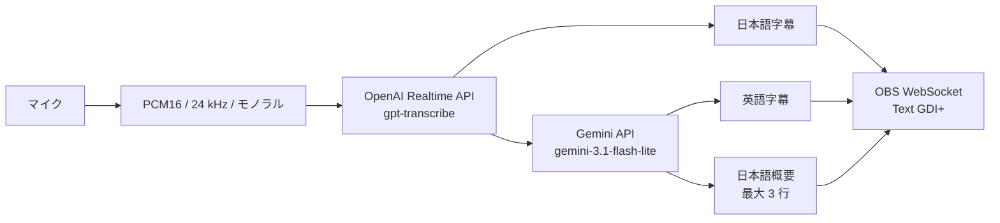

# 構成とデータフロー

## 目的

このツールは、日本語のマイク音声から日本語字幕、英語字幕、日本語の最大 3 行の概要を生成し、OBS Studio へ表示します。配信 PC の GPU を使わず、音声認識と文章生成を外部 API で処理します。

## 全体構成

日本語字幕は認識途中の差分から更新します。英訳は発話の確定後に生成します。概要は最初の確定発話で生成し、以後は確定発話の到着時に前回の生成完了から指定した最短間隔以上の経過を判定します。最短間隔は起動引数 `--summary-interval-seconds SECONDS` で指定し、省略時は 10 秒です。生成時は転写の確定時刻で選んだ直近 5 分間の発話を送り、範囲外の発話は含めません。新しい確定発話がない間は更新しません。

概要は発言の時点と時制を保ち、最大 3 行で表示します。同じ話題の列挙は可能な範囲で 1 行にまとめ、情報不足では無理に行を埋めません。1 行の最大文字数 `N` は起動引数 `--summary-max-chars N` で指定し、省略時は 30 文字とします。Gemini には `N-2` 文字を各行の厳密な上限として伝え、文字数を UTF-8 のバイト数ではなく日本語を含む文字数で数えるよう指示します。発言に十分な情報がある行には約 `0.8N` 文字を目安とします。返答が `N` 文字を超えた行は末尾を `(…)` にして `N` 文字以内に収めます。

概要生成では `temperature=0` を指定します。

## 文字起こしの固有名詞ヒント

`.env` または環境変数の `OPENAI_TRANSCRIPTION_KEYWORDS` に JSON 文字列配列を指定できます。同名の環境変数を優先し、起動時に設定を読み込みます。読み込んだ語句は OpenAI セッションの `audio.input.transcription.keywords` に渡し、再接続時も同じ語句を送信します。未設定、空の値、空配列の場合は `keywords` を送りません。

起動時に JSON 配列と要素の形式を検証します。空白だけの語句、API が禁止する `<`、`>`、改行を含む語句を拒否し、各語句の前後の空白を除去します。設定エラーと診断ログには語句を含めません。ヒントは認識の参考情報であり、出力の表記を保証するものではありません。使い方は[README の設定](../README.md#文字起こしの固有名詞ヒント)、仕様は[OpenAI の文字起こしガイド](https://developers.openai.com/api/docs/guides/transcription#improve-transcription-quality)を参照してください。

## 構成要素

| ファイル | 役割 |
| --- | --- |
| `app.py` | OBS、マイク、OpenAI、Gemini の起動と終了 |
| `audio.py` | マイク音声の取得と上限付きキュー |
| `transcription.py` | OpenAI Realtime API への音声送信と発話順序の管理 |
| `text_processing.py` | Gemini による英訳と最大 3 行の概要の生成 |
| `obs_output.py` | 三つの Text (GDI+) ソースの検査と更新 |
| `state.py` | 確定発話、発話順序、概要用の短期状態 |
| `diagnostics.py` | 本文を含めない JSON Lines 診断ログ |
| `config.py` | `.env` と環境変数からの設定読込み、概要の文字数上限と更新間隔の既定値 |

## 発話と表示の順序

OpenAI が割り当てた `item_id` と `previous_item_id` から発話順序を決めます。転写完了イベントが前後して届いた場合も、確定した順序で英訳と概要へ渡します。

日本語字幕は英訳を待ちません。英訳が前後して完了した場合は、新しい英訳を古い結果で上書きしません。概要生成中に届いた発話は次の更新時に直近 5 分の範囲へ含めます。

## 負荷上限

音声キューは 50 チャンクを上限とします。送信が入力へ追い付かない場合は古いチャンクから破棄し、破棄数を終了時のログへ記録します。OpenAI Realtime API へ再接続する際は、切断中に蓄積した音声と、前のセッションに残った未完了の発話状態を破棄します。再接続後に古い音声が遅れて表示されたり、新しい発話順序と衝突したりすることを防ぐためです。

概要用の確定発話は転写完了時刻とともにメモリへ保持し、次の発話の追加時と生成時に 5 分を過ぎた発話を除外します。順序待ちで遅れて渡された発話も、実際の転写完了時刻で判定します。概要生成に失敗した場合、次の対象範囲に残る発話は再利用します。日本語字幕は英訳や概要の失敗から独立して更新を続けます。

## OBS 出力

OBS WebSocket の `SetInputSettings` で、Text (GDI+) ソースの `text` だけを更新します。フォント、色、縁取り、背景、配置は OBS 側の設定を維持します。

接続先とソース名は現在の実装で固定されています。

- ホスト: `127.0.0.1`
- ポート: `4455`
- ソース名: `字幕（日本語）`、`字幕（英語）`、`概要（日本語）`

起動時に三つのソースが存在し、Text (GDI+) であり、`Read from file` が無効であることを確認します。起動時と終了時には三つの表示を空にします。

## 障害時の挙動

- OBS の接続または事前確認に失敗した場合は、外部 API を使う前に終了します。
- OpenAI Realtime API の一時的な接続エラーと予期しない接続終了は、最大 5 回まで再接続します。待機時間はジッター付き指数バックオフで増やし、16 秒を上限とします。
- 接続が 60 秒以上継続した後の切断は、連続再試行回数を 0 に戻します。短時間の接続失敗は最大回数で打ち切り、長時間の利用中に発生した単発の切断からは復旧できるようにしています。
- 認証エラー、API が通知した要求エラー、設定エラーは再試行せず終了します。再試行を使い切った場合も終了します。
- 英訳に失敗した場合は日本語字幕を継続し、英語字幕の最後の正常値を維持します。
- 概要生成に失敗した場合は日本語字幕と英訳を継続し、最後の正常な概要を維持します。
- OBS の個別更新に失敗した場合はほかの処理を継続し、エラーを診断ログへ記録します。

## データの送信と保存

| データ | 送信先 | ツールによるローカル保存 |
| --- | --- | --- |
| マイク音声 | OpenAI Realtime API | なし |
| 固有名詞ヒント | OpenAI Realtime API | 利用者の `.env` で管理。診断ログには記録しない |
| 確定した日本語発話 | Gemini API | 履歴ファイルなし。概要用にメモリへ保持し、次の追加時と生成時に直近 5 分へ絞る |
| 日本語字幕、英語字幕、概要 | ローカルの OBS WebSocket | 履歴は保存しない |
| 処理時間、件数、エラー種別 | `.logs/realtime-summary.jsonl` | 現行 1 ファイルと過去 5 ファイル。各最大 5 MiB |

診断ログへ音声、発話、字幕、英訳、概要、API キー、OBS WebSocket パスワードは記録しません。ただし、デバイス名と例外発生箇所のファイルパスは含まれる場合があります。

概要の診断には、起動時の文字数上限と更新間隔、Gemini 返答時点と OBS 送信時点の各行の文字数を記録します。本文を残さず、モデルの短縮と表示前の切り詰めを区別できます。

OBS がシーンコレクションを保存すると、表示中の文字列が OBS の設定ファイルやバックアップへ残る場合があります。外部 API 側のデータ保持条件は各サービスの規約を確認してください。

## 現在の制約

- Windows と Text (GDI+) を対象としています。
- 入力言語と生成する概要は日本語に固定されています。
- OBS の接続先、ポート、ソース名は設定から変更できません。
- GUI とプロバイダー切替機能はありません。

## 更新情報

- 0.3.0 (2026-09-29): 固有名詞ヒントの設定、検証、送信先を反映。
- 0.2.0 (2026-09-26): 概要の更新契機、直近 5 分の入力、起動引数と行長の診断を反映。
- 0.1.0 (2026-09-16): 初版を公開。
